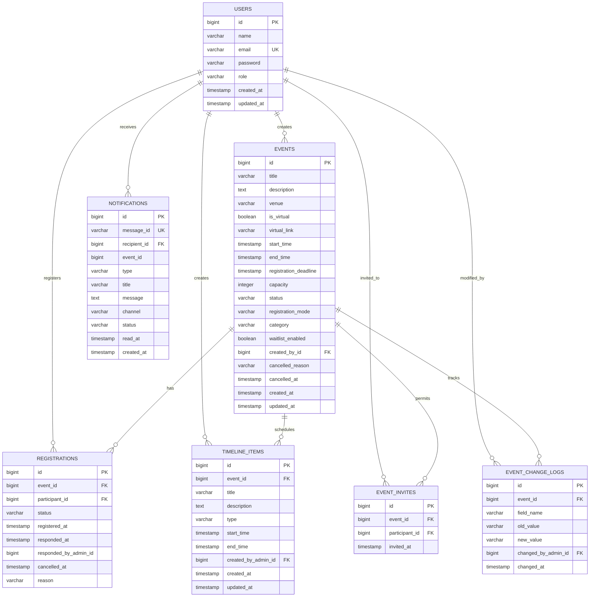

# CampusConnect / Relay — Implementation & Feature Specification

> **Comprehensive Technical Documentation of All Implemented Features, Architecture, Modules, and APIs**  
> *Last Updated: March 2026*

---

## 1. Executive Summary & System Architecture

**CampusConnect** (internally branded as **Relay**) is a cloud-native, enterprise-grade event management and operations platform designed for educational institutions, campuses, and multi-tenant organizations. The system orchestrates the complete lifecycle of campus events—ranging from draft authoring, multi-mode registration, schedule/milestone tracking, concurrency-safe capacity enforcement, automatic waitlist promotion, to asynchronous multi-channel notification dispatch and granular real-time analytics.

### 1.1 High-Level Architecture Overview

The system is engineered as an event-driven **Modular Monolith** backend paired with a modern, reactive single-page frontend application:

```
┌─────────────────────────────────────────────────────────────────────────────┐
│                       React 18 SPA (Vite + Vanilla CSS)                     │
│    Admin Portal  •  Super Admin Dashboard  •  Participant Portal  •  Live UI│
└──────────────────────────────────────┬──────────────────────────────────────┘
                                       │ REST / JWT Auth Bearer
                                       ▼
┌─────────────────────────────────────────────────────────────────────────────┐
│                    Spring Boot 3.x Modular Monolith Backend                 │
│  ┌───────────────────┐  ┌────────────────────┐  ┌────────────────────────┐  │
│  │ Auth & Security   │  │ Event Management   │  │ Registration Engine    │  │
│  │ (JWT, RBAC)       │  │ (CRUD, Audit Log)  │  │ (Pessimistic Locks)    │  │
│  └───────────────────┘  └────────────────────┘  └────────────────────────┘  │
│  ┌───────────────────┐  ┌────────────────────┐  ┌────────────────────────┐  │
│  │ Timeline Schedule │  │ Analytics Engine   │  │ Notification Engine    │  │
│  │ (Milestones/Rounds│  │ (Admin & SuperAdmin│  │ (@TransactionalEvents  │  │
│  └───────────────────┘  └────────────────────┘  └────────────────────────┘  │
└──────────────────┬──────────────────────────────────────────┬───────────────┘
                   │ JDBC / JPA                               │ AMQP
                   ▼                                          ▼
┌──────────────────────────────────────┐   ┌──────────────────────────────────┐
│        PostgreSQL Database           │   │         RabbitMQ Broker          │
│ Events • Registrations • Users       │   │ notification.exchange            │
│ Timeline • Notifications • AuditLogs │   │ notification.queue (Idempotent)  │
└──────────────────────────────────────┘   └──────────────────────────────────┘
```

### 1.2 Technology Stack

| Layer | Technologies & Frameworks | Description |
|---|---|---|
| **Frontend** | React 18, Vite, React Router v6, Recharts, Lucide Icons | Clean, responsive SPA with custom design system (`relay.css`) |
| **Backend** | Java 21, Spring Boot 3.x, Spring Security 6, Spring Data JPA | Modular monolith architecture with strict domain boundaries |
| **Messaging & Email** | RabbitMQ 3.x, Spring AMQP, Spring Mail, Thymeleaf, MailHog | Asynchronous, decoupled event publishing, HTML email templating, and local SMTP sink |
| **Persistence** | PostgreSQL 16+, Hibernate 6 | Relational persistence with pessimistic write locking and audit logs |
| **Authentication** | Stateless JWT (HMAC-SHA256 via jjwt), BCrypt | Role-based token claims, 24h default TTL, stateless session management |
| **Infrastructure** | Docker Compose | One-command bootstrapping of PostgreSQL and RabbitMQ |
| **Testing** | JUnit 5, MockMvc, AssertJ, Spring Test | Concurrency stress tests, waitlist promotion tests, RBAC security tests |

---

## 2. Role-Based Access Control (RBAC)

The system enforces three distinct user roles with strict hierarchical boundary checks in both Spring Security and domain service logic:

| Feature / Action | `PARTICIPANT` | `EVENT_ADMIN` | `SUPER_ADMIN` |
|---|:---:|:---:|:---:|
| Browse Published Events & View Details | ✅ | ✅ | ✅ |
| View Event Schedules / Timelines | ✅ | ✅ | ✅ |
| Register for Open Events | ✅ | ❌ (Organizer) | ❌ (Platform) |
| Join Waitlist when Event Full | ✅ | ❌ | ❌ |
| Self-Cancel Own Registration | ✅ | ❌ | ❌ |
| View Personal Registrations & Statuses | ✅ | ❌ | ❌ |
| Receive In-App Notifications & Mark as Read | ✅ | ✅ | ✅ |
| Create New Events (Drafts) | ❌ | ✅ | ✅ |
| Edit / Update Owned Events | ❌ | ✅ (Owned) | ✅ (All) |
| Publish / Cancel Events | ❌ | ✅ (Owned) | ✅ (All) |
| Reassign Event to Different Organizer | ❌ | ❌ | ✅ |
| Create / Edit / Delete Timeline Items | ❌ | ✅ (Owned) | ✅ (All) |
| Approve / Reject Pending Registrations | ❌ | ✅ (Owned) | ✅ (All) |
| Cancel Participant Registration (with Reason) | ❌ | ✅ (Owned) | ✅ (All) |
| Export Registrations to CSV | ❌ | ✅ (Owned) | ✅ (All) |
| Issue Event Invitations (Invite-Only Mode) | ❌ | ✅ (Owned) | ✅ (All) |
| View Event-Level Analytics & Registration Trends | ❌ | ✅ (Owned) | ✅ (All) |
| View Organizer Dashboard Metrics | ❌ | ✅ | ✅ |
| View Platform-Wide Metrics & User Distribution | ❌ | ❌ | ✅ |

---

## 3. Core Backend Modules & Implemented Features

### 3.1 Authentication & User Management (`com.campusconnect.auth`, `user`)
- **User Registration (`POST /api/auth/register`)**: Self-service account onboarding with name, email, encrypted password (BCrypt), and selectable role (`PARTICIPANT` or `EVENT_ADMIN`).
- **User Authentication (`POST /api/auth/login`)**: Validates credentials and returns signed stateless JWT tokens alongside user profile metadata.
- **Identity Introspection (`GET /api/auth/me`)**: Retrieves authenticated session context and role permissions.
- **Stateless JWT Security Filter (`JwtAuthenticationFilter`)**: Intercepts requests, validates token signature and expiration, extracts user ID and role claims, and populates Spring `SecurityContext`.
- **Database Seeder (`DatabaseSeeder`)**: In `dev` profile, automatically seeds pre-configured demo accounts:
  - `superadmin@example.com` (`SUPER_ADMIN`)
  - `admin@example.com` (`EVENT_ADMIN`)
  - `participant@example.com` (`PARTICIPANT`)

### 3.2 Event Management Engine (`com.campusconnect.event`)
- **Full Lifecycle State Machine**:
  - `DRAFT`: Private to organizer; editable without triggering attendee alerts.
  - `PUBLISHED`: Publicly browsable by participants; registration and schedule active.
  - `CANCELLED`: Terminal state with mandatory cancellation reason and timestamp.
  - `COMPLETED`: Archived event state after conclusion.
- **Rich Event Metadata**:
  - Title, description (up to 4000 chars), venue name.
  - Virtual event toggle (`isVirtual`) with strict validation for `virtualLink`.
  - Start time, end time, registration deadline (validated to be prior to start time).
  - Maximum attendee capacity.
  - Event Categories: `WORKSHOP`, `SEMINAR`, `CULTURAL`, `SPORTS`, `OTHER`.
- **Registration Modes**:
  - `OPEN`: Instant registration up to capacity.
  - `APPROVAL_REQUIRED`: Registration requests enter `PENDING` state until reviewed by an admin.
  - `INVITE_ONLY`: Access restricted strictly to users present on the event invite whitelist.
- **Event Administration**:
  - **Publish Event (`PATCH /api/events/{id}/publish`)**: transitions draft to published; publishes domain event.
  - **Cancel Event (`PATCH /api/events/{id}/cancel`)**: records cancellation reason and triggers notification broadcast to all active attendees.
  - **Reassign Event (`PATCH /api/events/{id}/reassign`)**: Super Admin exclusive feature enabling re-assignment of event ownership to another qualified administrator.
  - **Field Audit Trail (`EventChangeLog`)**: Automatically captures historical deltas on key modifications (`venue`, `startTime`, `endTime`, `status`, `createdBy`) including timestamp, previous value, new value, and admin ID.

### 3.3 Registration & Concurrency Engine (`RegistrationService`)
- **Pessimistic Row Locking (`findByIdForUpdate`)**:
  - Prevents race conditions during high-volume concurrent registration spikes.
  - Guarantees zero over-capacity registrations even under parallel multi-threaded requests.
- **Waitlist System**:
  - Configurable per-event via `waitlistEnabled`.
  - When capacity is exhausted, new registrants are gracefully placed in `WAITLISTED` status rather than rejected.
- **Automated FIFO Waitlist Promotion**:
  - When a confirmed participant cancels their registration (or is cancelled by an organizer), the engine executes `findFirstByEventAndStatusOrderByRegisteredAtAsc`.
  - The highest-priority waitlisted registrant is atomically promoted to `CONFIRMED`.
  - Emits `RegistrationConfirmedEvent`, triggering an automated confirmation alert to the promoted attendee.
- **Approval Workflow**:
  - Admins can individually `approve` or `reject` pending registrants.
  - Rejections support a custom rejection reason stored in the database.
- **Anti-Abuse Protections**:
  - Prevents duplicate registrations.
  - Disallows re-registration after a participant has cancelled or been rejected.
  - Enforces registration deadline cutoffs.
- **CSV Data Export (`GET /api/events/{id}/registrations/export`)**:
  - Streams CSV file download formatted with Registration ID, Participant ID, Participant Name, Status, Registration Date, Cancellation Date, and Stored Reason.

### 3.4 Timeline & Milestone Schedule Engine (`TimelineService`)
- **Granular Schedule Milestones**:
  - Supports schedule types: `REGISTRATION_OPEN`, `REGISTRATION_DEADLINE`, `ROUND`, `REPORTING_TIME`, `EVENT_START`, `EVENT_END`, `RESULT`, `MILESTONE`, `OTHER`.
- **Timeline Item Lifecycle**:
  - Title, description, schedule item type, start timestamp, end timestamp.
  - Strict date validation (`endTime > startTime`).
  - Public visibility for published events; full CRUD restricted to event organizer and Super Admin.
  - Changes logged to the event audit log and trigger notification events to registered participants.

### 3.5 Event-Driven Asynchronous Notification Engine (`notification`)
- **Transactional Decoupling**:
  - Employs Spring `@TransactionalEventListener(phase = TransactionPhase.AFTER_COMMIT)` with `REQUIRES_NEW` propagation.
  - Guarantees that notification messages are dispatched **only if the database transaction commits successfully**.
- **Message Broker Pipeline (RabbitMQ)**:
  - `NotificationProducer` converts internal domain events into standardized `NotificationMessage` payloads with unique UUID `messageId`.
  - Publishes messages to `notification.exchange` with routing key `notification.send`.
  - `NotificationConsumer` listens on `notification.queue` asynchronously.
- **Idempotency & Deduplication**:
  - Every message carries a unique `messageId`.
  - Consumer checks `notificationRepository.existsByMessageId(...)` prior to processing, eliminating duplicate notification creation upon network redeliveries.
- **Multi-Channel Dispatch (In-App & Email)**:
  - Notifications requested with `channel: EMAIL` trigger the `EmailProvider`.
  - The `EmailProvider` leverages **Spring Mail** to send emails via SMTP (using **MailHog** for local development) and **Thymeleaf** for rendering dynamic HTML templates.
  - Dedicated HTML templates exist for `registration-confirmed`, `registration-cancelled`, `registration-rejected`, `event-cancelled`, `timeline-updated`, and a `generic` fallback.
  - Email dispatch failures are logged and safely suppressed to prevent crashing the `NotificationConsumer` and rolling back the in-app notification save.
- **Supported Notification Triggers**:
  - `REGISTRATION_CONFIRMED`: Sent when a registration is confirmed or promoted from waitlist.
  - `REGISTRATION_WAITLISTED`: Sent when a user is placed on the waitlist.
  - `REGISTRATION_PENDING`: Sent to the event admin when an approval-required registration is requested.
  - `REGISTRATION_REJECTED`: Sent to participant when an admin rejects their application.
  - `REGISTRATION_CANCELLED`: Sent with cancellation reason when an admin or attendee cancels.
  - `EVENT_CANCELLED`: Broadcast to all active attendees when an event is cancelled.
  - `EVENT_VENUE_CHANGED` / `EVENT_TIME_CHANGED` / `EVENT_UPDATED`: Broadcast to all registered attendees with formatted diffs of updated event details.
  - `TIMELINE_UPDATED`: Broadcast to attendees when agenda items or rounds are added, updated, or removed.
- **Notification API & In-App Feed**:
  - Paginated notification retrieval with read/unread statuses.
  - Real-time unread counter endpoint (`/api/v1/notifications/unread-count`).
  - Single notification read marker (`POST /api/v1/notifications/{id}/read`).
  - Bulk read marker (`POST /api/v1/notifications/read-all`).

### 3.6 Analytics & Telemetry Engine (`AnalyticsService`)
- **Super Admin Platform Dashboard (`/api/analytics/superadmin`)**:
  - Total users breakdown by role (`PARTICIPANT`, `EVENT_ADMIN`, `SUPER_ADMIN`).
  - Total events breakdown (`DRAFT`, `PUBLISHED`, `CANCELLED`, upcoming count).
  - Total registrations platform-wide (`CONFIRMED`, `PENDING`, `WAITLISTED`).
  - Total notifications processed across the platform.
- **Event Admin Dashboard (`/api/analytics/admin`)**:
  - Organizer-specific event tallies (total, draft, published, cancelled, upcoming).
  - Organizer-specific registration counts across all organized events.
- **Event-Level Deep Analytics (`/api/analytics/events/{eventId}`)**:
  - Capacity utilization percentage (`confirmed / capacity * 100`).
  - Real-time available seat counter.
  - Registration status distribution (Confirmed, Waitlisted, Pending, Cancelled, Rejected).
  - Chronological daily registration volume trends (`RegistrationTrendDto`) for Recharts data visualization.

---

## 4. Database Schema & Data Models

### 4.1 Relational Schema Diagram



---

## 5. Complete REST API Specification

### 5.1 Authentication (`/api/auth`)
| Method | Endpoint | Auth Required | Description |
|---|---|:---:|---|
| `POST` | `/api/auth/register` | No | Register a new user (`name`, `email`, `password`, `role`) |
| `POST` | `/api/auth/login` | No | Authenticate user credentials and receive JWT |
| `GET` | `/api/auth/me` | Yes | Get currently authenticated user details and role |

### 5.2 Events (`/api/events`)
| Method | Endpoint | Allowed Roles | Description |
|---|---|---|---|
| `GET` | `/api/events` | All | List events (filtered by role and visibility) |
| `GET` | `/api/events?category={cat}` | All | List events filtered by category |
| `GET` | `/api/events/{id}` | All | Get detailed event metadata |
| `POST` | `/api/events` | Admin, SuperAdmin | Create new event draft |
| `PATCH` | `/api/events/{id}` | Owner, SuperAdmin | Update event details (triggers audit log & change alerts) |
| `DELETE` | `/api/events/{id}` | Owner, SuperAdmin | Delete an event and associated change logs |
| `PATCH` | `/api/events/{id}/publish` | Owner, SuperAdmin | Publish event draft |
| `PATCH` | `/api/events/{id}/cancel` | Owner, SuperAdmin | Cancel event with reason |
| `PATCH` | `/api/events/{id}/reassign` | SuperAdmin | Reassign event to another admin |

### 5.3 Registrations (`/api/events/{id}/registrations`)
| Method | Endpoint | Allowed Roles | Description |
|---|---|---|---|
| `POST` | `/api/events/{id}/registrations` | Participant | Register for event (concurrency-safe with locking) |
| `GET` | `/api/events/{id}/registrations` | Owner, SuperAdmin | Paginated list of event registrations with optional status filter |
| `POST` | `/api/events/{id}/registrations/{regId}/approve` | Owner, SuperAdmin | Approve pending registration |
| `POST` | `/api/events/{id}/registrations/{regId}/reject` | Owner, SuperAdmin | Reject pending registration with reason |
| `POST` | `/api/events/{id}/registrations/{regId}/cancel` | Owner, SuperAdmin, Self | Cancel registration (triggers waitlist auto-promotion) |
| `GET` | `/api/events/{id}/registrations/export` | Owner, SuperAdmin | Stream CSV download of all registrations |
| `POST` | `/api/events/{id}/invites` | Owner, SuperAdmin | Bulk invite participant IDs for invite-only events |
| `GET` | `/api/participants/me/registrations` | Participant | Get all registrations for current participant |

### 5.4 Timelines (`/api/events/{id}/timeline`)
| Method | Endpoint | Allowed Roles | Description |
|---|---|---|---|
| `GET` | `/api/events/{id}/timeline` | All | Fetch all timeline items for event sorted by start time |
| `POST` | `/api/events/{id}/timeline` | Owner, SuperAdmin | Add a new schedule milestone / round |
| `PUT` | `/api/events/{id}/timeline/{itemId}` | Owner, SuperAdmin | Update existing timeline item |
| `DELETE` | `/api/events/{id}/timeline/{itemId}` | Owner, SuperAdmin | Remove timeline item from event schedule |

### 5.5 Notifications (`/api/v1/notifications`)
| Method | Endpoint | Allowed Roles | Description |
|---|---|---|---|
| `GET` | `/api/v1/notifications?page=0&size=20` | All Authenticated | Paginated in-app notification history |
| `GET` | `/api/v1/notifications/unread-count` | All Authenticated | Count of unread notifications |
| `POST` | `/api/v1/notifications/{id}/read` | Recipient | Mark specific notification as read |
| `POST` | `/api/v1/notifications/read-all` | Recipient | Mark all recipient notifications as read |

### 5.6 Analytics (`/api/analytics`)
| Method | Endpoint | Allowed Roles | Description |
|---|---|---|---|
| `GET` | `/api/analytics/superadmin` | SuperAdmin | Platform-wide user, event, registration, and notification metrics |
| `GET` | `/api/analytics/admin` | Admin, SuperAdmin | Organizer metrics for owned events and registrations |
| `GET` | `/api/analytics/events/{id}` | Owner, SuperAdmin | Capacity utilization, status breakdown, and daily trends |

---

## 6. Frontend Architecture & User Interface

The frontend is built using standard React 18, React Router v6, and vanilla CSS (`relay.css`), avoiding heavyweight CSS frameworks while delivering a polished, high-contrast, modern UI.

### 6.1 State Management & Session Context
- **`AuthContext.jsx`**:
  - Manages JWT persistence in `localStorage`.
  - Automatically loads and hydrates authenticated user profile on application boot.
  - Exposes `login`, `logout`, `token`, `user`, and `role` to all components.
- **Route Protection (`ProtectedRoute`)**:
  - Intercepts unauthorized navigation, redirecting unauthenticated users to `/login`.
  - Dynamically renders role-specific dashboard views at `/` and `/events`.

### 6.2 Key Frontend Pages & Implemented Capabilities

1. **Authentication Screens (`LoginPage.jsx`, `RegisterPage.jsx`)**:
   - Quick Demo Account autofill buttons for rapid testing across `Super Admin`, `Event Admin`, and `Participant`.
   - Comprehensive registration form with client-side error handling and role selection.

2. **Top Navigation Bar (`TopHeader`)**:
   - Platform search bar.
   - Dynamic notification bell with real-time **unread notification counter badge**.
   - User profile badge displaying initials, full name, and human-friendly role badge (`Super Admin`, `Event Admin`, `Participant`).

3. **Participant Portal (`ParticipantPage.jsx`, `ParticipantEventsPage.jsx`)**:
   - Metric cards showing registered events, upcoming schedules, and waitlist positions.
   - Categorized event cards with status pills, badges, date formatting, and virtual event indicators.
   - Filterable event catalog with category selection pills (`WORKSHOP`, `SEMINAR`, `CULTURAL`, `SPORTS`, `OTHER`) and search.

4. **Event Details View (`EventDetailPage.jsx`)**:
   - Hero header with category icon badges, date/time chips, venue or virtual join link.
   - Registration status banners (Confirmed, Pending Approval, Waitlisted, Cancelled, Rejected).
   - Dynamic registration button adapting to event state: *Register*, *Join Waitlist*, *Awaiting Approval*, *Registration Closed*, or *Already Registered*.
   - Self-cancellation action with confirmation modal.
   - Embedded interactive visual timeline (`TimelineDisplay.jsx`) rendering chronologically ordered event milestones and round timings.

5. **My Registrations Tracker (`MyRegistrationsPage.jsx`)**:
   - Dedicated feed of all events the participant has enrolled in.
   - Clear visual status badges with color coding.
   - Displays cancellation or rejection reason when provided by administrators.
   - Quick navigation to event details and instant self-cancellation action.

6. **Notification Center (`NotificationsPage.jsx`)**:
   - Rich list of notifications with custom icons based on notification type:
     - 🟢 Confirmed (CheckCheck)
     - 🟠 Waitlisted / Pending (CalendarClock / Info)
     - 🔴 Cancelled / Rejected (XCircle)
     - 🟣 Event Published / Schedule Updated (BellRing / CalendarClock)
     - 🔵 Venue / Time Changed (Info)
   - "Mark all as read" button.
   - Click-to-navigate action automatically routing to the related event or registration page.

7. **Event Organizer Control Center (`AdminPage.jsx`)**:
   - Organizer metric cards (Total Events, Published, Draft, Upcoming, Registrations).
   - Dual-mode event form: Create new event or Edit existing event with full validation.
   - Action controls for Publishing drafts and Cancelling published events with reason modal.
   - Sub-tab interface for selected event:
     - **Details**: Full metadata editor.
     - **Timeline (`AdminTimeline.jsx`)**: Inline creator and editor for schedule items, milestone types, and time slots.
     - **Registrations (`AdminRegistrations.jsx`)**: Paginated registrant table, status filters (Confirmed, Pending, Waitlisted, Cancelled, Rejected), one-click Approve/Reject, cancellation with reason prompt, participant invitation modal, and CSV export button.

8. **Super Admin Operations Hub (`SuperAdminPage.jsx`)**:
   - Platform Health cards: Total Users, Total Event Admins, Total Registrations, Notifications Dispatched.
   - Event health metrics and global event directory.
   - Admin re-assignment trigger.

9. **Event Analytics Studio (`EventAnalyticsPage.jsx`)**:
   - Capacity utilization visual gauge.
   - Key metric counters: Confirmed, Waitlisted, Pending, Cancelled, Rejected, Available Seats.
   - **Pie Chart (Recharts)** showing proportional breakdown of registration statuses.
   - **Line Chart (Recharts)** charting daily registration growth trends over time.

---

## 7. Testing & Quality Assurance

The codebase includes integration tests validating core domain invariants:

| Test Class | Test Target | Verification Details |
|---|---|---|
| `RegistrationConcurrencyIntegrationTest` | Concurrency & Race Conditions | Uses `ExecutorService` and `CountDownLatch` with 15 concurrent threads targeting an event with capacity of 5. Verifies exactly 5 registrations are confirmed and no overbooking occurs. |
| `WaitlistPromotionIntegrationTest` | Automated Waitlist Promotion | Fills capacity, places subsequent participant on waitlist, cancels a confirmed registration, and asserts that the first waitlisted participant is automatically promoted to `CONFIRMED`. |
| `NotificationIntegrationTest` | End-to-End Notification Flow | Exercises event creation, registration, updates, and cancellations; verifies transactional event publishing and message persistence. |
| `SecurityAccessTest` | Role-Based Access Control | Validates HTTP 401 Unauthorized for anonymous access and HTTP 403 Forbidden across illegal cross-role endpoint invocations. |
| `AuthControllerTest` | Authentication API | Validates registration, duplicate email rejection, login success, bad credentials rejection, and JWT generation. |
| `EventServiceTest` & `EventControllerTest` | Event Domain Logic | Validates date order validations, virtual link rules, ownership checks, and audit logging. |

---

## 8. Deployment, Infrastructure & Configuration

### 8.1 Docker Compose Environment (`backend/docker-compose.yml`)
Bootstraps external infrastructure with zero local software installation required:
- **PostgreSQL 16**: Port `5432`, database `campusconnect`, user/password `postgres/postgres`.
- **RabbitMQ 3 Management**: AMQP on port `5672`, Web Management Dashboard on port `15672` (`guest`/`guest`).
- **MailHog**: Local SMTP sink on port `1025`, Web UI for viewing captured emails on port `8025`.

### 8.2 Application Configuration Profiles
- **`application.yml`**: Centralized configuration with environment variable overrides:
  - Database URL, credentials, Hibernate DDL auto-update.
  - RabbitMQ host, port, credentials.
  - JWT secret key and token expiration (`JWT_EXPIRATION_MS: 86400000`).
  - Spring Boot Actuator monitoring endpoints (`/actuator/health`, `/actuator/metrics`, `/actuator/info`).
- **`dev` Profile**: Activates `DatabaseSeeder` to provision demo accounts.
- **`test` Profile**: In-memory / isolated testing configurations.

---

## 9. Summary of Implemented Artifacts

```
SEproject/
├── backend/
│   ├── docker-compose.yml              # PostgreSQL + RabbitMQ container configuration
│   ├── pom.xml                         # Maven dependencies & build configuration
│   ├── src/main/java/com/campusconnect/
│   │   ├── analytics/                  # Dashboard responses, trend DTOs, metrics service & controller
│   │   ├── auth/                       # JWT service, auth controller, login/register DTOs
│   │   ├── common/                     # Security config, CORS, error handling, database seeder
│   │   ├── event/                      # Event, Registration, Timeline, Invites, AuditLog models & services
│   │   ├── notification/               # RabbitMQ messaging, consumer, producer, in-app notification repository
│   │   │   └── email/                  # EmailProvider and Thymeleaf setup
│   │   └── user/                       # User model, Role enum, UserRepository
│   ├── src/main/resources/
│   │   └── templates/email/            # HTML Thymeleaf templates for notification emails
│   └── src/test/java/com/campusconnect/
│       ├── auth/                       # Auth controller unit tests
│       ├── common/security/            # RBAC integration tests
│       ├── event/                      # Concurrency & waitlist promotion integration tests
│       └── notification/               # End-to-end notification integration tests
├── src/
│   ├── api/relayApi.js                 # Complete REST client wrapper for all backend APIs
│   ├── contexts/AuthContext.jsx        # JWT auth context & session restoration
│   ├── components/
│   │   ├── AdminRegistrations.jsx      # Registrations table, approval/rejection, CSV export
│   │   ├── AdminTimeline.jsx           # Timeline item manager
│   │   ├── TimelineDisplay.jsx         # Attendee visual schedule display
│   │   ├── Sidebar.jsx                 # Dynamic role-based navigation sidebar
│   │   ├── EventCard.jsx               # Event overview card
│   │   └── LiveFeed.jsx / Waterfall.jsx# Live activity and trace waterfall components
│   ├── pages/
│   │   ├── AdminPage.jsx               # Event Admin control center
│   │   ├── SuperAdminPage.jsx          # Super Admin platform dashboard
│   │   ├── ParticipantPage.jsx         # Participant homepage
│   │   ├── ParticipantEventsPage.jsx   # Event catalog with filters & search
│   │   ├── EventDetailPage.jsx         # Event overview, timeline, registration actions
│   │   ├── EventAnalyticsPage.jsx      # Recharts visualizations (Pie, Line charts, gauges)
│   │   ├── MyRegistrationsPage.jsx     # Registration tracker with cancellation reasons
│   │   ├── NotificationsPage.jsx       # Real-time notification center
│   │   ├── LoginPage.jsx               # Login screen with demo credentials autofill
│   │   └── RegisterPage.jsx            # Account creation screen
│   └── styles/relay.css                # Custom modern design system tokens and styling
├── system_diagrams.md                  # Activity diagrams, DFD Levels 0-2, sequence diagrams
└── IMPLEMENTATION.md                   # This comprehensive specification
```
