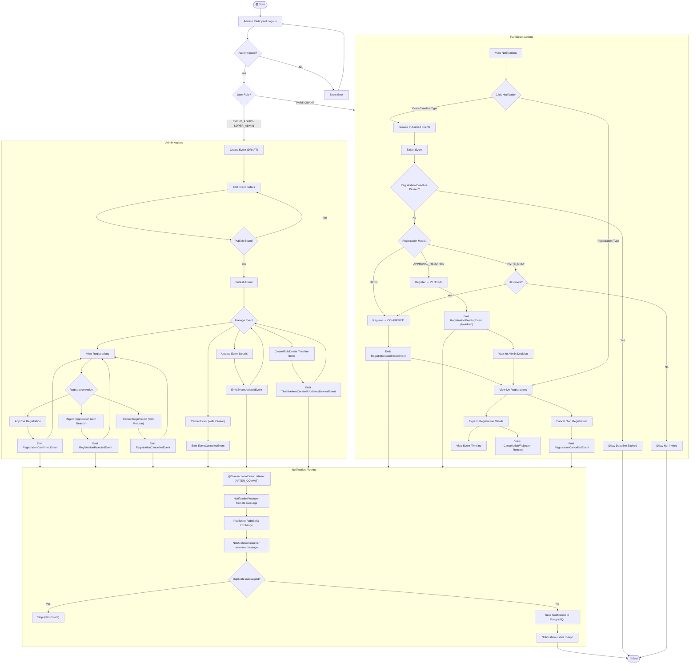
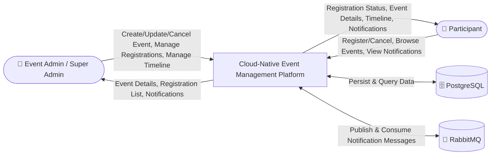
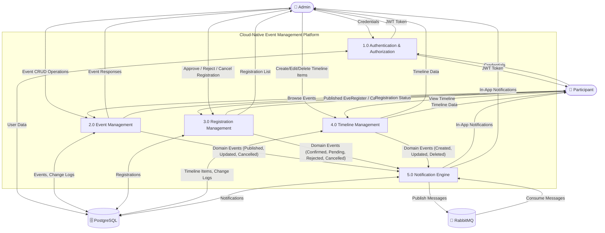
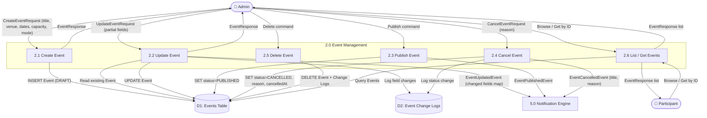
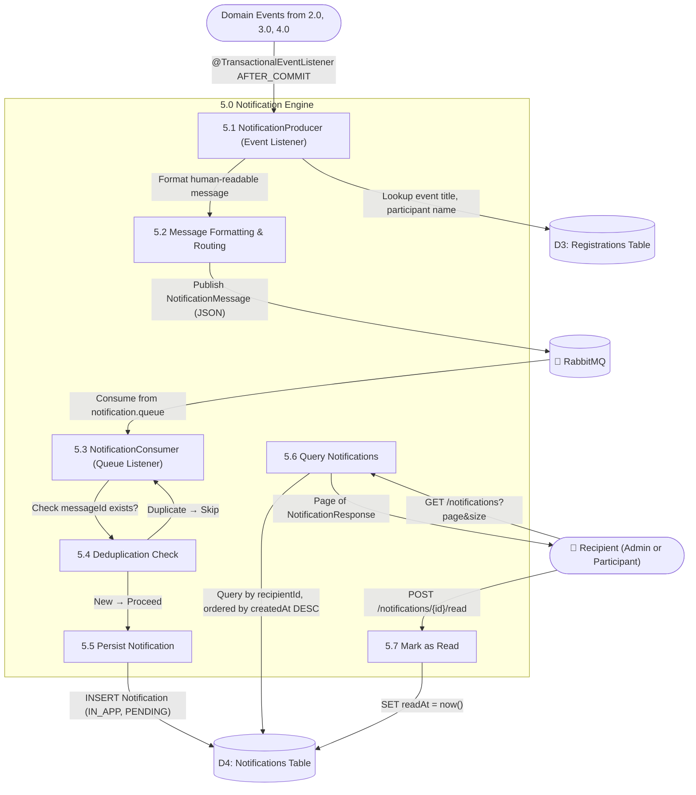
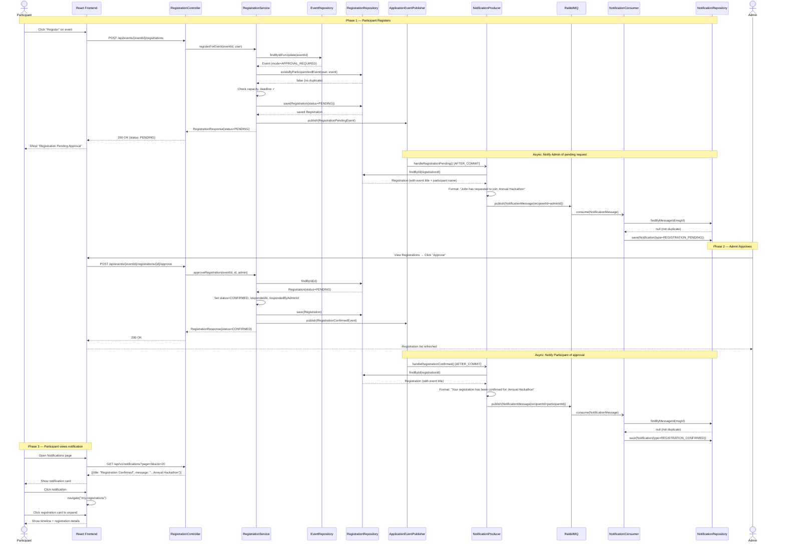

# Cloud-Native Event Management Platform — Diagrams

---

## 1. Activity Diagram — Event Lifecycle & Registration Flow

This diagram captures the full lifecycle from event creation through registration, approval, timeline management, and notification delivery.

---

## 2. DFD Level 0 — Context Diagram

Shows the entire system as a single process interacting with external entities.

---

## 3. DFD Level 1 — Subsystem Decomposition

Decomposes the platform into its core subsystems.

---

## 4. DFD Level 2 — Detailed Process Decomposition

### 4a. Process 2.0 — Event Management (Detailed)

### 4b. Process 3.0 — Registration Management (Detailed)

```mermaid
flowchart TB
    Participant(["👤 Participant"])
    Admin(["👤 Admin"])

    subgraph RegMgmt["3.0 Registration Management"]
        P3_1["3.1 Register for Event"]
        P3_2["3.2 Cancel Registration"]
        P3_3["3.3 Approve Registration"]
        P3_4["3.4 Reject Registration"]
        P3_5["3.5 List Registrations"]
        P3_6["3.6 View My Registrations"]
    end

    EventsDB[("D1: Events Table")]
    RegDB[("D3: Registrations Table")]
    NotifEngine["5.0 Notification Engine"]

    Participant -->|"POST /registrations"| P3_1
    P3_1 -->|"findByIdForUpdate (lock row)"| EventsDB
    P3_1 -->|"Check mode, capacity, deadline, duplicates"| P3_1
    P3_1 -->|"INSERT Registration (CONFIRMED / PENDING / WAITLISTED)"| RegDB
    P3_1 -->|"RegistrationConfirmedEvent OR RegistrationPendingEvent OR RegistrationWaitlistedEvent"| NotifEngine
    P3_1 -->|"RegistrationResponse"| Participant

    Participant -->|"POST /cancel (optional reason)"| P3_2
    Admin -->|"POST /cancel (with reason)"| P3_2
    P3_2 -->|"SET status=CANCELLED, reason, cancelledAt"| RegDB
    P3_2 -->|"RegistrationCancelledEvent (reason)"| NotifEngine

    Admin -->|"POST /approve"| P3_3
    P3_3 -->|"SET status=CONFIRMED, respondedAt, respondedByAdminId"| RegDB
    P3_3 -->|"RegistrationConfirmedEvent"| NotifEngine

    Admin -->|"POST /reject (with reason)"| P3_4
    P3_4 -->|"SET status=REJECTED, reason, respondedAt"| RegDB
    P3_4 -->|"RegistrationRejectedEvent"| NotifEngine

    Admin -->|"GET /registrations?status&page"| P3_5
    P3_5 -->|"Query by event + optional status filter"| RegDB
    P3_5 -->|"Page of RegistrationResponse"| Admin

    Participant -->|"GET /me/registrations"| P3_6
    P3_6 -->|"Query by participant"| RegDB
    P3_6 -->|"List of RegistrationResponse (with reason)"| Participant
```

### 4c. Process 5.0 — Notification Engine (Detailed)

---

## 5. Sequence Diagram — Registration with Approval Flow

This covers the end-to-end flow: a Participant registers for an approval-required event, the Admin approves, and the Participant receives an in-app notification.

